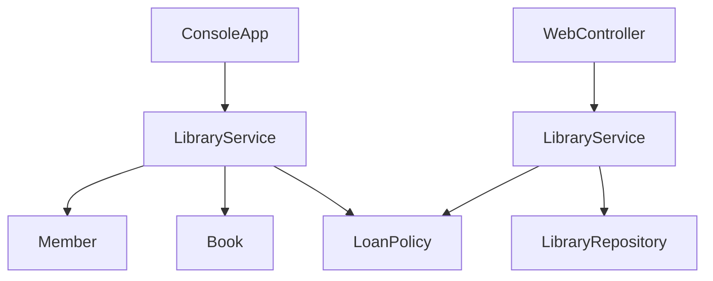

# 図書貸出デモ案

## 推奨する題材

`図書貸出ミニアプリ` が学習用途として相性が良いです。理由は次の通りです。

- OOP を学びやすい: `Book`、`Member`、`Loan`、`LibraryService` のように役割を自然に分けられる
- Spring Boot を学びやすい: `Controller`、`Service`、`Repository` に切り分けやすい
- 業務ルールを入れやすい: `貸出中なら借りられない`、`上限冊数を超えたら不可` などで設計の意味が出る
- 画面や API を最小構成にしやすい: 一覧、貸出、返却だけで成立する

## 学習の進め方

1. 純粋な Java でコンソール版を作る
2. 同じドメインモデルを Spring Boot に移す
3. `new` でつないでいた依存関係が、Spring の DI でどう置き換わるか比較する
4. HTTP 経由で `貸出` と `返却` を操作できるようにして、フレームワークの役割を体感する

## 具体的な構成案

コンソール版では次の責務に分けます。

- `Book`: 本の情報と貸出状態を持つ
- `Member`: 会員情報と貸出冊数を持つ
- `LoanPolicy`: 貸出可否の判定を担当する
- `LibraryService`: 貸出・返却のユースケースを担当する
- `LibraryApp`: 動作確認用の `main`

Spring Boot 版では同じ概念を次に対応させます。

- `Controller`: リクエスト受付
- `Service`: 業務ルール実行
- `Repository`: データ保持
- `Model/Entity相当`: `Book`、`Member`、`Loan`

## 既存構成とのつながり

- [JavaSample/lesson05_classes_and_objects/Lesson05ClassesAndObjects.java](/Users/nagahamayuu/Documents/Projects/tutorial/java-tutorial/JavaSample/lesson05_classes_and_objects/Lesson05ClassesAndObjects.java) の延長として、単一クラスの `Person` から複数クラス協調へ進める
- [JavaApp/demo/src/main/java/com/example/demo/DemoApplication.java](/Users/nagahamayuu/Documents/Projects/tutorial/java-tutorial/JavaApp/demo/src/main/java/com/example/demo/DemoApplication.java) を起点に、`controller`、`service`、`repository` パッケージを足していく
- [JavaApp/demo/pom.xml](/Users/nagahamayuu/Documents/Projects/tutorial/java-tutorial/JavaApp/demo/pom.xml) には Web 系依存関係がすでにあるため、最小の Spring Boot デモへ発展しやすい

## 実装ステップ

- `JavaSample` 側に図書貸出のコンソール版サンプルを追加する
- クラス間の責務とメソッド設計をコメント少なめで読みやすく整理する
- `JavaApp/demo` 側に同じドメインの `Controller`、`Service`、`Repository` を作る
- 初期データをメモリ保持にして、DB なしで動くようにする
- `GET /books`、`POST /loans`、`POST /returns` など最小 API を用意する
- 必要なら最後に簡単な HTML 画面を 1 枚だけ追加し、API の結果を見える化する

## 代替案

もし図書貸出より好みがあれば、次も学習向きです。

- `タスク管理`: もっと簡単。ただし OOP の広がりはやや弱い
- `注文管理`: 実務っぽいが、最初の題材としては少し重い
- `学校の成績管理`: 分かりやすいが、Spring の業務フローは図書貸出の方が見せやすい
