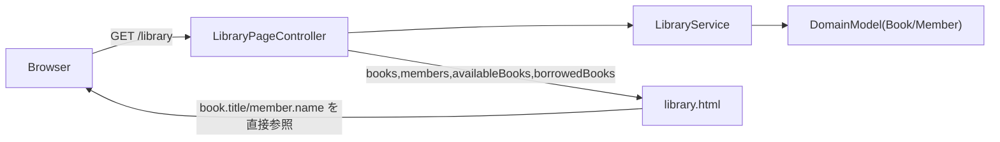
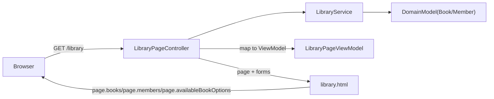
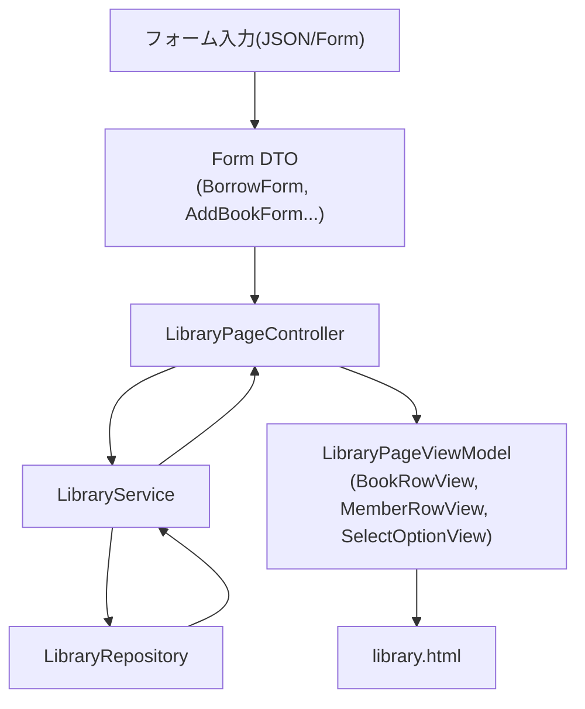

# Phase 2: 画面用 DTO / ViewModel 分離

## 目的

- 入力（Form DTO）と表示（ViewModel）を分離して、`LibraryPageController` と `library.html` の見通しを上げる。
- 今後の例外整理・DB化で変更点を局所化しやすくする。

## 現状整理（維持するもの）

- 入力用DTO（`BorrowForm` / `ReturnForm` / `AddBookForm` / `AddMemberForm`）とバリデーションは現状維持。
- 画面テンプレートの表示仕様（列、文言、フォーム構成）は原則維持。

## 既存からの変更点（Before/After）

### Before（現状）

- `library.html` が `Book` / `Member` のドメイン項目を直接参照している（`book.title` など）。
- `LibraryPageController` がフォーム初期化と表示データ投入を1つの流れで扱っている。
- 画面都合のデータ形（一覧行・プルダウン表示）が Controller と Template に分散している。

### After（Phase 2 完了後）

- 入力は従来どおり Form DTO（`BorrowForm` など）を使用する。
- 表示は `LibraryPageViewModel` と行/選択肢用ViewModelに統一する。
- `library.html` は `page.*` のみ参照し、ドメインモデル直接参照をやめる。

## 変更内容ごとのメリット

- **責務分離の明確化**: Form DTO は入力、ViewModel は表示に限定され、読み解きやすくなる。
- **テンプレートの安定化**: `Book` / `Member` の内部構造変更がそのまま `library.html` 破壊につながりにくい。
- **Controller の保守性向上**: `populateForms()` と `populateViewData()` の分離で、修正時の影響範囲を限定できる。
- **DB化への準備**: JPA Entity に置き換えても、Template 側は ViewModel 契約を維持しやすい。
- **テストしやすさ向上**: 「表示データ変換」の単位で検証でき、画面不具合の切り分けがしやすい。

関連ファイル:

- [JavaApp/demo/src/main/java/com/example/demo/library/controller/LibraryPageController.java](JavaApp/demo/src/main/java/com/example/demo/library/controller/LibraryPageController.java)
- [JavaApp/demo/src/main/resources/templates/library.html](JavaApp/demo/src/main/resources/templates/library.html)
- [JavaApp/demo/src/main/java/com/example/demo/library/service/LibraryService.java](JavaApp/demo/src/main/java/com/example/demo/library/service/LibraryService.java)

## 実装方針

1. **ViewModelクラスを追加**
   - 例: `BookRowView`, `MemberRowView`, `SelectOptionView` を `library/view`（または `library/dto/view`）配下に新設。
   - 画面で使う最小項目だけを保持（例: 本一覧は `id/title/author/statusLabel/isBorrowed`）。

2. **ページ全体用ViewModelを追加**
   - 例: `LibraryPageViewModel` を作成し、一覧とプルダウン元データを集約。
   - `books`, `members`, `availableBookOptions`, `borrowedBookOptions` を保持。

3. **ControllerでViewModelを組み立てる責務を明確化**
   - `populateLibraryPage()` を `populateForms()` と `populateViewData()` 相当に分離。
   - テンプレートへ `page`（または `viewModel`）1つを渡し、散在属性を減らす。

4. **テンプレートをViewModel参照へ置換**
   - `books` -> `page.books`、`members` -> `page.members` などに段階置換。
   - フォームの `th:object` は現行のまま維持し、バリデーション表示を壊さない。

5. **既存挙動の回帰確認**
   - 一覧表示、貸出/返却/追加/登録、バリデーションエラー表示、フラッシュメッセージを確認。

## データ責務の整理図

## 設計ルール（Phase 2で固定する）

- Form DTO: 「受け取るための型」
- ViewModel: 「表示するための型」
- Service: 業務ロジック中心。View都合の文字列整形は最小化（必要なら mapper 層へ寄せる）

## 変更順（小さく安全に進める）

- Step 1: `BookRowView` / `MemberRowView` / `SelectOptionView` 追加
- Step 2: `LibraryPageViewModel` 追加
- Step 3: `LibraryPageController` に変換メソッド追加・`populateLibraryPage()` 更新
- Step 4: `library.html` を `page.*` 参照へ更新
- Step 5: 表示/バリデーション回帰チェック

## 完了条件

- `library.html` がドメインモデル（`Book`/`Member`）直接参照せず、ViewModelのみ参照している。
- Form DTO + `BindingResult` のバリデーション表示が従来どおり動作する。
- ユーザー操作（貸出/返却/本追加/会員登録）の結果が変わらない。
