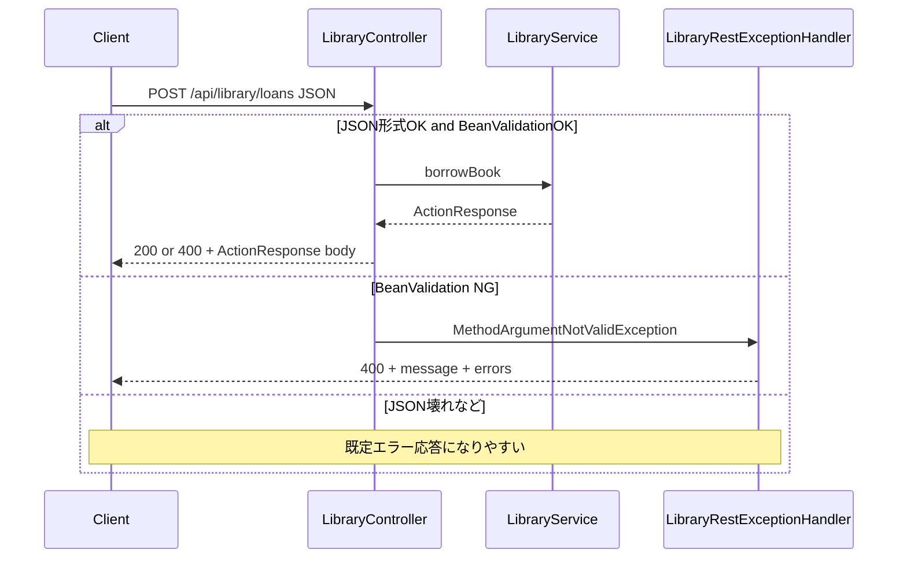
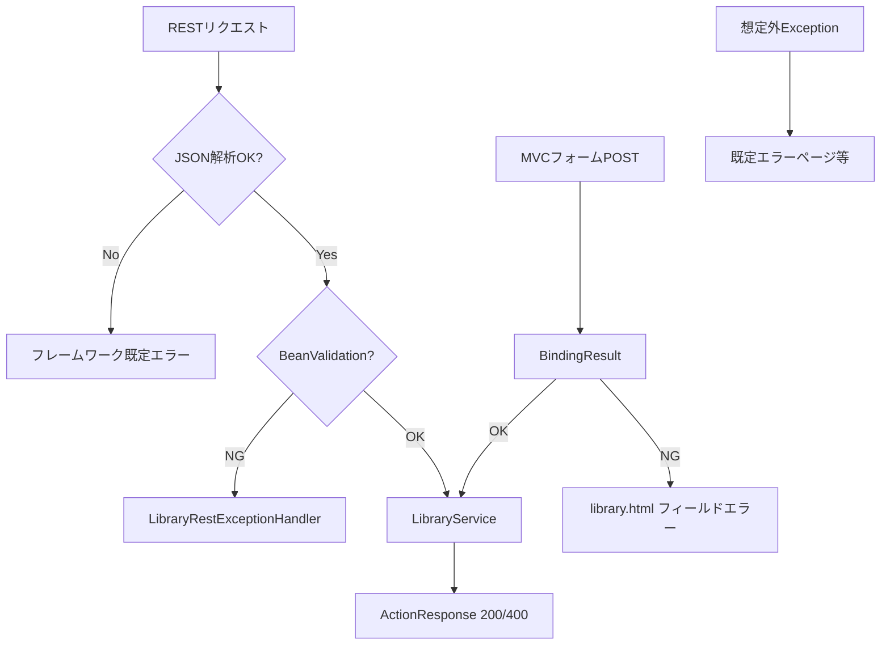
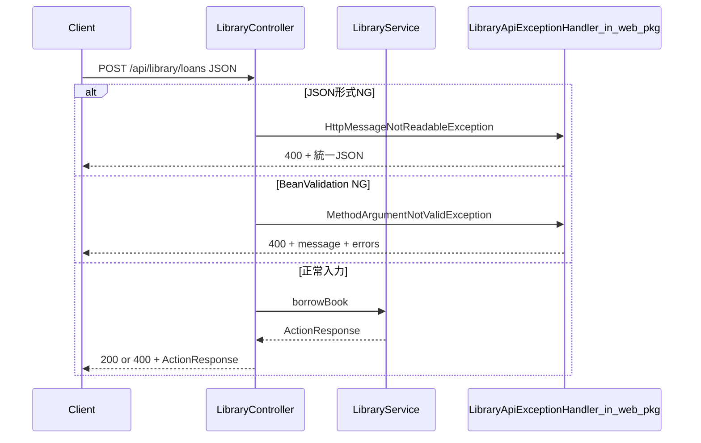
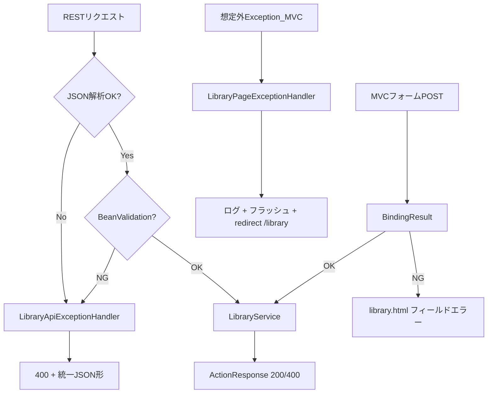
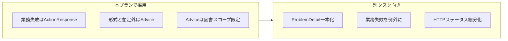

# 図書デモ: 例外処理整理プラン（現状・変更後・効果）

## ゴール

- **想定内の業務失敗**はこれまで通り [`LibraryService`](JavaApp/demo/src/main/java/com/example/demo/library/service/LibraryService.java) の `ActionResponse` で表現する。
- **Bean Validation 失敗・JSON 形式不正・想定外例外**は `@ControllerAdvice` / `@RestControllerAdvice` に集約し、置き場所と JSON/画面の振る舞いを揃える。
- 図書 API/画面以外へ影響しないよう、**`assignableTypes` でスコープ限定**を維持・踏襲する。

## 現状（As-Is）

### REST: 成功経路と業務失敗

[`LibraryController`](JavaApp/demo/src/main/java/com/example/demo/library/controller/LibraryController.java) は `ActionResponse` の `success` で HTTP 200 / 400 を切り替える。例外は投げない。

### REST: バリデーション失敗のみ Advice

[`LibraryRestExceptionHandler`](JavaApp/demo/src/main/java/com/example/demo/library/controller/LibraryRestExceptionHandler.java) は `MethodArgumentNotValidException` のみ。JSON 壊れ（`HttpMessageNotReadableException`）などはハンドラ外。

### MVC

フォームは `BindingResult` でフィールドエラー表示。想定外例外用の図書専用 `@ControllerAdvice` はなし。

### シーケンス図（現状・REST 貸出）

### フロー図（現状・エラー種別の落ち先）

## 変更後（To-Be）

### 1. REST Advice の拡張と配置の整理

- [`LibraryRestExceptionHandler`](JavaApp/demo/src/main/java/com/example/demo/library/controller/LibraryRestExceptionHandler.java) を **`com.example.demo.library.web`** に移し、クラス名は例: `LibraryApiExceptionHandler`。
- **追加ハンドラ**: `HttpMessageNotReadableException` → 400、body は既存と同系統（`message` + 必要なら空の `errors` など）で**形を揃える**。
- `@RestControllerAdvice(assignableTypes = LibraryController.class)` は維持。

### 2. MVC 想定外用 Advice（最小）

- 新規: `@ControllerAdvice(assignableTypes = LibraryPageController.class)`。
- `Exception`（または最初は `RuntimeException`）を捕捉 → **ログ** + **`RedirectAttributes` フラッシュ** + `redirect:/library`（教材としてシンプル）。専用 `library-error.html` は任意（採用するならどちらかに統一）。

### 3. ドキュメント

- [`JavaApp/docs/ARCHITECTURE.md`](JavaApp/docs/ARCHITECTURE.md) に短い節を追加: **業務失敗 = ActionResponse**、**形式・想定外 = Advice**。ディレクトリ説明に `web`（例外ハンドラ）を追記。

### シーケンス図（変更後・REST 貸出）

### フロー図（変更後・エラー種別の落ち先）

## 変化のまとめ（何がどう変わるか）

| 観点                | 現状                    | 変更後                         |
| ------------------- | ----------------------- | ------------------------------ |
| REST 不正 JSON      | 既定応答になりやすい    | 図書 API 用 400 + 揃えた JSON  |
| REST ハンドラの場所 | `controller` パッケージ | `library.web` に集約           |
| MVC 想定外          | 既定エラーページ寄り    | 図書画面へ戻してメッセージ制御 |
| 業務失敗            | `ActionResponse`        | **変更なし**（教材の軸を維持） |

## 嬉しいこと（メリット）

1. **読み手が迷わない**: 業務は Service の戻り値、形式・想定外は Advice と境界が明確。
2. **API クライアント向け**: バリデーション NG と JSON 不正で応答形を近づけられる。
3. **デモ体験**: MVC で例外が出ても `/library` に戻せる。
4. **影響範囲**: `assignableTypes` で図書コントローラに限定しやすい。

## ベストプラクティスとの関係とトレードオフ

Spring に「公式の唯一解」はなく、チームやプロダクトで選ばれるパターンが分かれる。本プランは **教材として読みやすさを優先した折衷** であり、次のトレードオフを理解したうえで採用する。

### 実務でもよく評価される点（本プランと整合）

- **Advice のスコープ限定**（`assignableTypes`）でグローバルハンドラの肥大化を避ける。
- **入力検証失敗と JSON 形式不正を Advice に集約**し、API 利用者に一貫した 400 と説明を返す。
- **想定外はログ＋ユーザー向けの汎用メッセージ**にし、スタックや内部詳細を画面に出さない。

### トレードオフ 1: 業務失敗を `ActionResponse` に残す

| 選択 | メリット | デメリット / 実務で別案が出る理由 |
|------|----------|-------------------------------------|
| **本プラン**: Service が `ActionResponse` を返す | 制御フローが直線的で教材向き。Controller が薄い。 | REST の「エラー body の形」が、バリデーション失敗時（`message` + `errors`）と業務失敗時（`success` + `message`）で**完全には同一にならない**（本プランでは JSON のトップレベルを近づける方向で緩和）。 |
| **代替**: ドメイン例外 + `@ExceptionHandler` +（任意）`ProblemDetail` | エラー表現をフレームワーク流に一本化しやすい。HTTP ステータスを種類ごとに細かく付けやすい。 | 例外型の設計・マッピングの説明コストが上がり、入門教材としては重くなりがち。 |

**本プランの位置付け**: 学習用デモでは `ActionResponse` を維持し、**形式・想定外だけ Advice** に寄せるのは合理的な妥協点。

### トレードオフ 2: 業務 NG の HTTP ステータス（例: 一律 400）

| 選択 | メリット | デメリット |
|------|----------|------------|
| **現状踏襲**: 業務失敗も多くは 400 + body | 実装が単純。 | クライアントが「衝突」「状態不整合」などをステータスだけで区別しにくい。 |
| **代替**: 409 Conflict / 422 Unprocessable Entity などに細分化 | API の意味論が明確になりやすい。 | どの失敗にどのコードを割り当てるか設計・文書化が必要。 |

**本プランの位置付け**: ステータス設計の議論はスコープ外。必要なら **別タスク**でマッピング表を追加する。

### トレードオフ 3: MVC で想定外 `Exception` を広く捕まえる

| 選択 | メリット | デメリット |
|------|----------|------------|
| **本プラン**: `Exception`（または `RuntimeException`）を捕捉してリダイレクト | デモ中の体験が崩れにくい。 | 捕まえすぎると、本番でバグの発見が遅れることがある。**必ずログにスタックを残す**ことが前提。 |
| **代替**: 捕捉する例外型を限定し、それ以外は既定のエラー処理に任せる | 不具合の見逃しを減らしやすい。 | 網羅とメンテナンスのコストが増える。 |

**本プランの位置付け**: 教材では「フォールバックの置き場」を示すことを優先し、実装時は **ログ必須**を完了条件に含める。

### トレードオフ 4: `ProblemDetail`（RFC 7807）を今回入れない

| 選択 | メリット | デメリット |
|------|----------|------------|
| **本プラン**: 既存の `Map` body を拡張・揃える | 変更が小さく、Spring Boot 入門の流れを壊しにくい。 | 大規模 API や社内標準が ProblemDetail 中心の場合、後から寄せる移行が発生し得る。 |
| **代替**: エラー応答を `ProblemDetail` に統一 | エラー形式の標準化・クライアント実装の再利用に有利。 | 教材のコード量と概念が増える。 |

**本プランの位置付け**: 「スコープ外」に明記済み。実務寄りに振るなら **次フェーズ**として切り出す。

### 方針の要約（図）

## スコープ外（今回やらない）

- `ActionResponse` を全面廃止してドメイン例外のみにする大規模リファクタ。
- `ProblemDetail` への全面移行（必要なら別タスク）。

## 主要タッチファイル

- 移動・拡張: [JavaApp/demo/src/main/java/com/example/demo/library/controller/LibraryRestExceptionHandler.java](JavaApp/demo/src/main/java/com/example/demo/library/controller/LibraryRestExceptionHandler.java) → `library/web/` 新規
- 変更なし〜軽微: [JavaApp/demo/src/main/java/com/example/demo/library/controller/LibraryController.java](JavaApp/demo/src/main/java/com/example/demo/library/controller/LibraryController.java)
- 新規: `library/web/LibraryPageExceptionHandler.java`（名前は調整可）
- 新規テスト推奨: `HttpMessageNotReadableException` を誘発する `MockMvc` テストを [JavaApp/demo/src/test/java/com/example/demo/library/controller/](JavaApp/demo/src/test/java/com/example/demo/library/controller/) に追加
- ドキュメント: [JavaApp/docs/ARCHITECTURE.md](JavaApp/docs/ARCHITECTURE.md)

## 完了条件

- `./mvnw test` が成功する。
- 不正 JSON POST で図書 API が意図した 400 + body になる。
- （実装方針に従い）MVC 想定外のフォールバックが動作する。
- MVC 想定外ハンドラで **例外をログに残す**（スタックトレースが追えること）。
