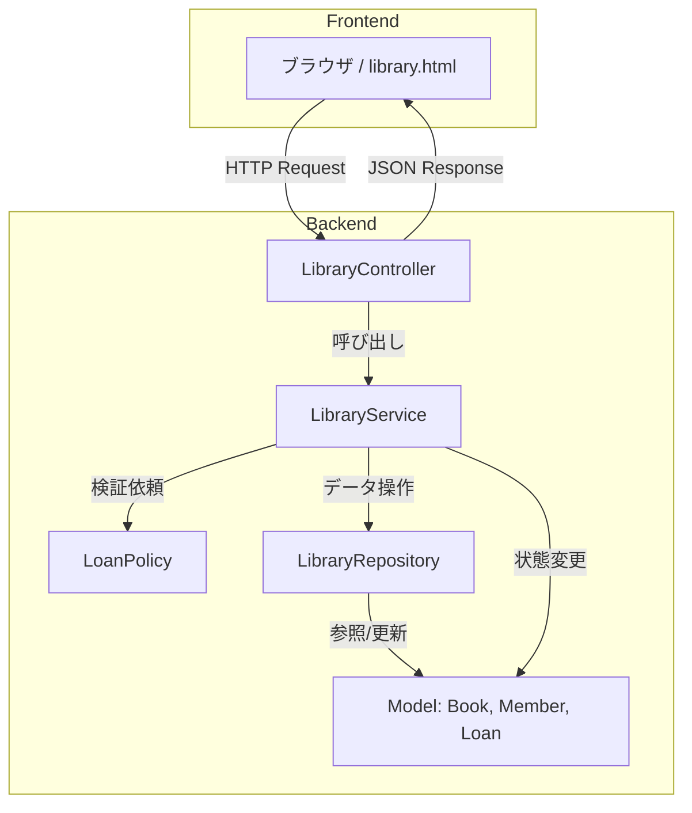
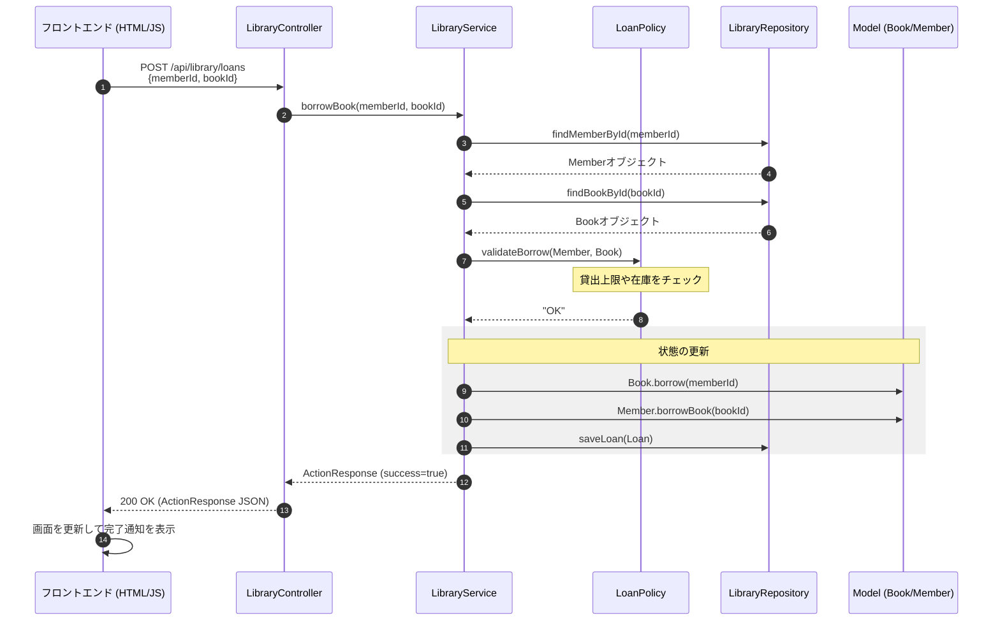

# プロジェクト構成・アーキテクチャ解説

このドキュメントでは、本プロジェクトの全体構成、システムアーキテクチャ、およびデータの流れについて解説します。

---

## 1. プロジェクト全体概要

本プロジェクトは、Javaの基礎学習から実践的なWebアプリケーション開発までを段階的に学べるように構成されています。

- **JavaSample**: Javaの基本文法からオブジェクト指向の基礎までを網羅したサンプル集です。
- **JavaApp (demo)**: `JavaSample`で学んだオブジェクト指向の概念を、Spring Bootフレームワークを用いてWebアプリケーションとして実装した実践例です。

---

## 2. ディレクトリ構成

プロジェクトの主要なディレクトリ構成と役割は以下の通りです。

```text
.
├── JavaSample/                # Java基礎学習用サンプル
│   ├── lesson01_variables/    # 各レッスンごとのディレクトリ
│   │   ├── Lesson01Variables.java
│   │   └── Lesson01Variables.md
│   └── lesson21_oop_library_demo/ # オブジェクト指向を用いた図書貸出管理（コンソール版）
└── JavaApp/
    └── demo/                  # Spring Bootによる図書貸出管理アプリ
        ├── src/main/java/com/example/demo/library/
        │   ├── controller/    # APIエンドポイント（外部との接続）
        │   ├── service/       # 業務ロジック（貸出・返却のルール）
        │   ├── repository/    # データアクセス（データの保存・取得）
        │   ├── model/         # ドメインモデル（本、会員、貸出情報）
        │   └── dto/           # データ転送オブジェクト（リクエスト・レスポンス用）
        └── src/main/resources/
            ├── static/        # フロントエンド資産（library.html）
            └── application.properties # アプリ設定
```

---

## 3. システムアーキテクチャ

`JavaApp/demo` は、一般的な **レイヤードアーキテクチャ** を採用しています。

### コンポーネント関連図



### 各レイヤーの責務

| レイヤー | クラス例 | 責務 |
| :--- | :--- | :--- |
| **Presentation** | `LibraryController` | HTTPリクエストを受け取り、適切なサービスを呼び出し、結果をレスポンス(JSON)として返します。 |
| **Business** | `LibraryService`, `LoanPolicy` | 「本を借りる」「返却する」といった業務ロジックを実行します。貸出可否の判定（ポリシー）もここに含まれます。 |
| **Data Access** | `LibraryRepository` | データの永続化を担います。本デモではメモリ上の `Map` や `List` でデータを保持しています。 |
| **Domain** | `Book`, `Member`, `Loan` | システムで扱う対象（エンティティ）の状態と、それに関連する振る舞いを持ちます。 |

---

## 4. データの流れ

「ユーザーが本を借りる」操作を例に、データの流れをシーケンス図で示します。



### データの整合性維持
- `LibraryService` が司令塔となり、`LoanPolicy` によるチェックを通った場合のみ、`Model` の状態変更と `Repository` への保存を行います。
- `JavaSample` 版と `JavaApp` 版で、このドメインロジック（`Model` や `LoanPolicy`）がほぼ共通化されている点が、オブジェクト指向設計の利点です。
