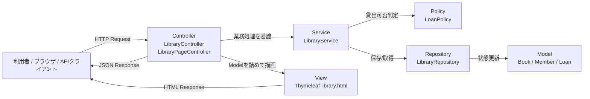
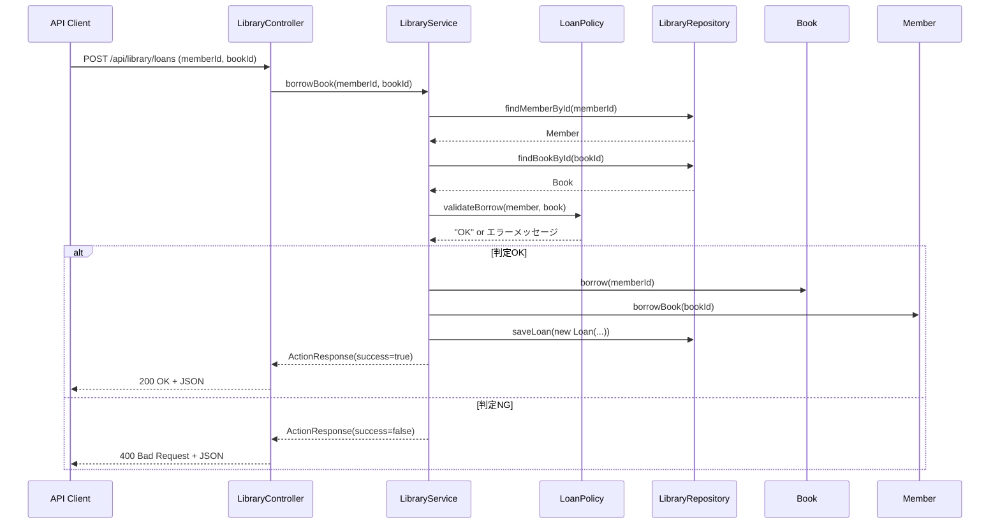
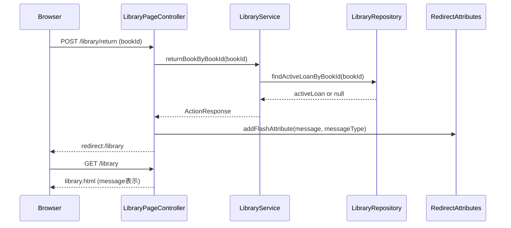
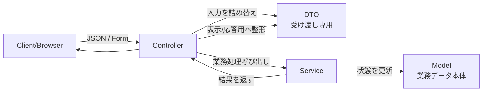

# Spring Boot 仕組み解説（初心者向け）

このドキュメントは、`JavaApp/demo` の図書貸出アプリを題材に、Spring Boot が「なぜ動くのか」を初心者向けに説明するものです。  
`JavaSample` で Java/OOP の基本を学んだあとに読む前提で書いています。

---

## 0. まず 5 分で動かす（読んでから触るより先に動かす）

「説明は後でいいので、まず動く体験をしたい」人向けの最短手順です。

前提（最低限）:

- Java 17 以上が入っている
- ターミナルで `JavaApp/demo` に移動できる

手順:

1. アプリ起動: `./mvnw spring-boot:run`
2. 画面を開く: `http://localhost:8080/library`
3. API確認（任意）: `http://localhost:8080/api/library/books`

確認できれば OK:

- 画面URLで一覧ページが開く
- API URLで JSON が返る

ここまでで覚えるのは 1 つだけ: **Spring Boot は「起動して URL にアクセスできる Web アプリ」を素早く作れる**。

---

## 0.5 最低限の用語ミニ辞典（最初はこれだけ）

- **Bean**: Spring が管理しているオブジェクト（自分で `new` しないことが多い）
- **DI（依存性注入）**: 必要な部品をコンストラクタ引数などで受け取る仕組み
- **コンテナ**: Bean の生成・保持・配線を担当する Spring の入れ物
- **PRG パターン**: POST の後に Redirect して、再送信を避ける定番手法
- **MVC**: Model（データ）/ View（画面）/ Controller（受け口）に役割を分ける考え方
- **DTO**: 画面や API とデータをやり取りするための入れ物オブジェクト
- **ResponseEntity**: HTTP ステータスコードとレスポンス本文を一緒に返すための型
- **RedirectAttributes**: リダイレクト先の 1 回だけ使うメッセージを渡す仕組み
- **コンポーネントスキャン**: `@Controller` などを見つけて Bean 登録する処理
- **in-memory**: メモリ上だけでデータを持つ方式（再起動で消える）
- **JPA**: Java から DB を扱いやすくする標準仕様
- **H2**: 学習や検証で使いやすい軽量データベース

---

## 1. まず結論: Spring Boot は何をしてくれるのか

Spring Boot をひとことで言うと、**アプリ起動に必要なセットアップを自動化して、業務ロジック実装に集中させてくれる仕組み**です。

Java の通常プログラムでは `main` の中で自分で `new` して依存関係をつなげます。  
Spring Boot では次をフレームワークが担当します。

- オブジェクト（Bean）の生成
- オブジェクト同士の依存関係の接続（DI）
- HTTP リクエストの受け取りと Controller 呼び出し
- JSON 変換、テンプレート描画（Thymeleaf）
- 組み込みサーバー（Tomcat）起動

つまり、**「自分で全部配線する」から「役割を定義して任せる」**への考え方の変化が最初の壁です。

ここまでで覚えるのは 1 つだけ: **Spring Boot は「配線作業」を減らして業務ロジックに集中させる**。

---

## 2. 起動時に実際なにが起こるか

`DemoApplication` は非常に短いですが、この 1 行で多くの初期化が始まります。

```java
@SpringBootApplication
public class DemoApplication {
    public static void main(String[] args) {
        SpringApplication.run(DemoApplication.class, args);
    }
}
```

主な流れ:

1. `@SpringBootApplication` を起点にコンポーネントスキャン（用語ミニ辞典参照）が走る  
2. `@Controller` / `@Service` / `@Repository` / `@Component` を見つける  
3. 見つけたクラスのインスタンス（Bean）を作る  
4. コンストラクタ引数を見て依存関係を注入する  
5. Web アプリとして Tomcat を立ち上げ、ルーティングを有効化する

`@SpringBootApplication` は次の 3 つをまとめたものです（概念として押さえれば十分です）。

- `@SpringBootConfiguration`
- `@EnableAutoConfiguration`
- `@ComponentScan`

初心者向けには「**このアノテーションが、Spring の自動設定スイッチ**」という理解で OK です。

ここまでで覚えるのは 1 つだけ: **`SpringApplication.run` で、Bean の生成と Web 起動が始まる**。

---

## 3. DI（依存性注入）をこのプロジェクトで見る

### 3.1 コンストラクタインジェクションの意味

`LibraryController` は `LibraryService` を直接 `new` していません。

```java
public class LibraryController {
    private final LibraryService libraryService;

    public LibraryController(LibraryService libraryService) {
        this.libraryService = libraryService;
    }
}
```

これは「**必要な依存を引数で宣言し、生成は Spring に任せる**」書き方です。

`LibraryService` 側も同様です。

```java
public class LibraryService {
    private final LibraryRepository libraryRepository;
    private final LoanPolicy loanPolicy;

    public LibraryService(LibraryRepository libraryRepository, LoanPolicy loanPolicy) {
        this.libraryRepository = libraryRepository;
        this.loanPolicy = loanPolicy;
    }
}
```

これにより:

- クラスの責務が明確になる
- テスト時に差し替えしやすい
- `new` の連鎖が減り、読みやすくなる

### 3.2 「なぜ `new` しないの？」への答え

初心者が最もつまずくポイントです。結論は次です。

- `new` は「作り方の責務」を持つ
- 業務クラスは「業務ロジック」に集中したい
- 生成・配線はコンテナ（Spring）に任せる方が全体が整理される

ここまでで覚えるのは 1 つだけ: **「必要なものは引数で宣言、作るのは Spring」が DI の基本**。

---

## 4. レイヤー構成の見方（このアプリ版）

このプロジェクトは典型的なレイヤー分割になっています。

- `controller`: 入出力の担当（HTTP, 画面遷移）
- `service`: 業務ルールの担当（貸出/返却条件）
- `repository`: データ保持・取得の担当（今は in-memory）
- `model`: ドメインの状態と振る舞い（Book/Member/Loan）
- `dto`: API の受け渡し用データ構造

### 4.1 API 用 Controller

`LibraryController`（`@RestController`）は JSON API を提供します。

- `GET /api/library/books`
- `GET /api/library/members`
- `GET /api/library/loans`
- `POST /api/library/loans`
- `POST /api/library/returns`

`@RestController` は「戻り値をレスポンスボディとして返す（JSON 化する）」前提の Controller です。

### 4.2 画面用 Controller

`LibraryPageController`（`@Controller`）は `Model` に値を詰めてテンプレート名 `library` を返します。

- `GET /library`: 一覧画面描画
- `POST /library/borrow`: 貸出実行後にリダイレクト
- `POST /library/return`: 返却実行後にリダイレクト
- `POST /library/books`: 本追加
- `POST /library/members`: 会員追加

`RedirectAttributes`（用語ミニ辞典参照）でメッセージをフラッシュ属性として渡しているので、リダイレクト後に画面へ表示できます。

### 4.3 Service が中心である理由

貸出・返却のルールは `LibraryService` に集中しています。  
Controller は「受け取り・返し方」を担当し、判定ロジックを持ちません。

この分離ができていると:

- API と画面の両方から同じ業務ロジックを再利用できる
- UI の変更が業務ロジックに波及しにくい

### 4.4 レイヤー全体フロー図

文章だけだと追いにくいので、全体の流れを 1 枚で見ると次のようになります。



ここまでで覚えるのは 1 つだけ: **Controller は入口、Service は業務の中心、Repository はデータ担当**。

---

## 5. リクエストが処理される流れ（具体例）

### 5.1 API から本を借りる (`POST /api/library/loans`)

1. クライアントが JSON を送る（`memberId`, `bookId`）  
2. `LibraryController.borrowBook` が `LoanRequest` にマッピング  
3. `LibraryService.borrowBook` を呼ぶ  
4. `LoanPolicy.validateBorrow` で条件判定  
5. `Book` / `Member` / `Loan` を更新  
6. `ActionResponse` を返す  
7. Controller が `ResponseEntity`（用語ミニ辞典参照）で `200` or `400` を返す

ここで学べるのは「**HTTP の責務と業務ルールの責務を分ける**」という設計です。

最小のリクエスト/レスポンス例:

```json
// Request: POST /api/library/loans
{
  "memberId": 1,
  "bookId": 2
}
```

```json
// 成功時 Response (200)
{
  "success": true,
  "message": "貸出しました"
}
```

```json
// 失敗時 Response (400)
{
  "success": false,
  "message": "貸出上限を超えています"
}
```

### 5.2 画面から返却する (`POST /library/return`)

1. フォーム送信で `bookId` が飛ぶ  
2. `LibraryPageController.returnBook` が受ける  
3. `LibraryService.returnBookByBookId` を呼ぶ  
4. 成功/失敗メッセージを `RedirectAttributes` に積む  
5. `redirect:/library` で再表示

画面遷移では「POST の後にリダイレクト（PRG パターン）」を使っており、二重送信を避けやすくしています。

### 5.3 シーケンス図（API 貸出）

`POST /api/library/loans` の内部で何が呼ばれるかを時系列で表すと次の通りです。



### 5.4 シーケンス図（画面返却）

`POST /library/return` は「実行してから画面に戻る」流れです。



ここまでで覚えるのは 1 つだけ: **同じ Service を API と画面の両方が使う**。

---

## 6. Thymeleaf テンプレートの見方

`src/main/resources/templates/library.html` は、`LibraryPageController` が渡した `Model` の値を描画します。

代表的な記法:

- `th:each`: 繰り返し表示
- `th:text`: テキスト埋め込み
- `th:if`: 条件表示
- `th:action`: フォーム送信先 URL
- `th:classappend`: 条件で CSS クラス追加

たとえば「貸出可能/貸出中」バッジは、`book.borrowed` を見てクラスを切り替えています。  
このように、**表示ロジックは View 側、業務判定は Service 側**に分かれています。

ここまでで覚えるのは 1 つだけ: **Thymeleaf は「Model の値を画面に出す」担当**。

---

## 7. 初心者がつまずきやすいポイントと見方

### 7.1 アノテーションが多くて怖い

最初は意味を全部覚えなくて大丈夫です。  
まずはこの 5 つだけで十分です。

- `@SpringBootApplication`: アプリ起動の基点
- `@RestController`: JSON を返す Controller
- `@Controller`: 画面表示用 Controller
- `@Service`: 業務ロジック層
- `@Repository`: データアクセス層

### 7.2 どこを読めば流れを追えるか分からない

この順で読むと理解しやすいです。

1. `DemoApplication`（起点）
2. `LibraryPageController`（画面の入口）
3. `LibraryService`（業務ルール本体）
4. `LibraryRepository`（データ保持）
5. `library.html`（画面描画）

### 7.3 API と画面が混ざって見える

このアプリでは「同じ Service を API と MVC（用語ミニ辞典参照）で共有」しています。  
入口（Controller）が違うだけで、業務ロジックの核は同じです。

ここまでで覚えるのは 1 つだけ: **アノテーションは最初は 5 つ覚えれば十分**。

---

## 8. `JavaSample` との対応関係

`JavaSample` でやっていたことを、Spring Boot 版でどう置き換えているかを表にすると次の通りです。

| JavaSample の見方 | Spring Boot 版の見方 |
|---|---|
| `main` が `new` で配線する | Spring が Bean を作って配線する |
| メソッド呼び出し中心 | HTTP + Controller 経由で呼ばれる |
| 画面なし（コンソール） | MVC 画面（Thymeleaf）あり |
| 手作業で入出力 | DTO（用語ミニ辞典参照） / Model / View に分離 |

### 8.1 DTO と Model の違い（ここで混乱しやすい）

混ざりやすい 2 つですが、役割は次のように分けます。



短く言うと:

- **DTO**: 入出力の形をそろえるための箱（通信・画面向け）
- **Model**: 業務ルールで更新される中心データ

「外とやり取りする形」が DTO、「アプリ内部で意味を持つ状態」が Model と覚えると区別しやすいです。

「難しくなった」のではなく、**役割分担が増えて現実のアプリに近づいた**と捉えると理解しやすいです。

ここまでで覚えるのは 1 つだけ: **JavaSample の `main + new` を Spring が代わりに担当している**。

---

## 9. 次の学習ステップ（このプロジェクトで拡張するなら）

1. `@Valid` と `BindingResult` を使ったバリデーション導入  
2. 例外ハンドリング（`@ControllerAdvice`）を追加  
3. in-memory（用語ミニ辞典参照）`Repository` を JPA + H2（用語ミニ辞典参照）に置き換える  
4. テスト追加（Service 単体 / Controller の Web テスト）  
5. DTO と ViewModel の役割をさらに明確化

---

## 10. まとめ

このプロジェクトの本質は次の 2 点です。

- **業務ロジックの中心は `LibraryService` に置く**
- **オブジェクト生成・配線・Web 基盤は Spring Boot に任せる**

この 2 点を押さえると、Spring Boot のコードが「魔法」に見えにくくなります。  
分からなくなったら、まず「このクラスの責務は何か」を言葉にしてから読むのがおすすめです。
