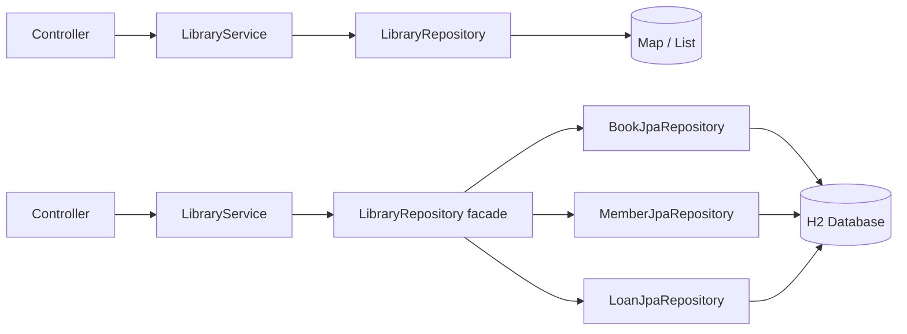
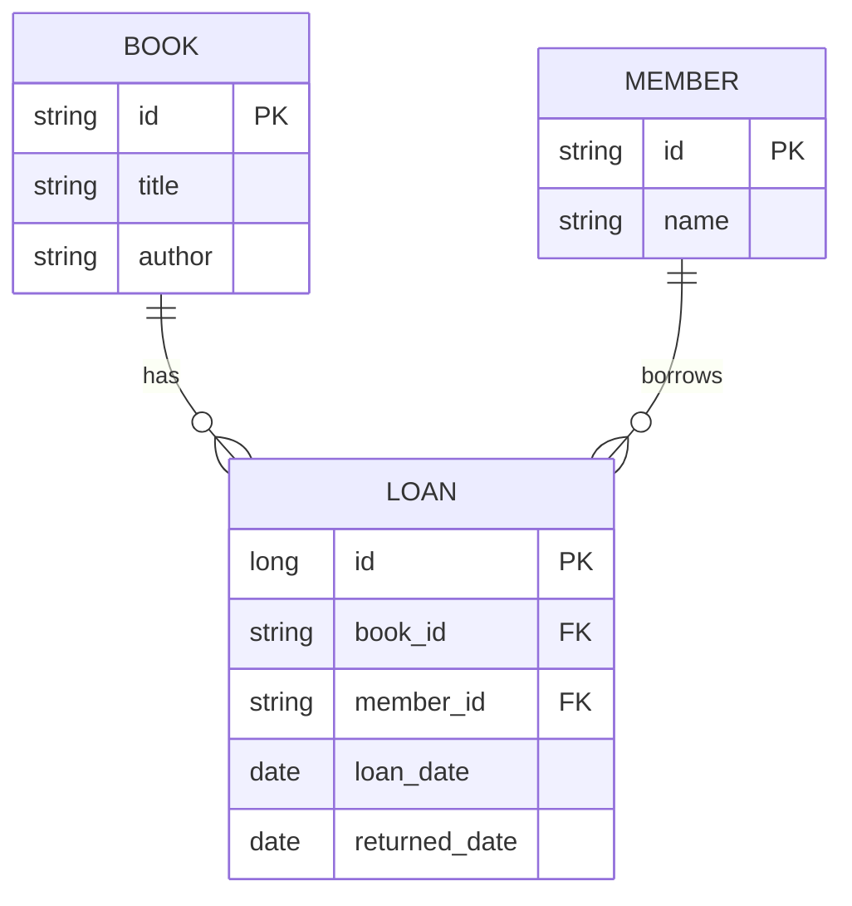
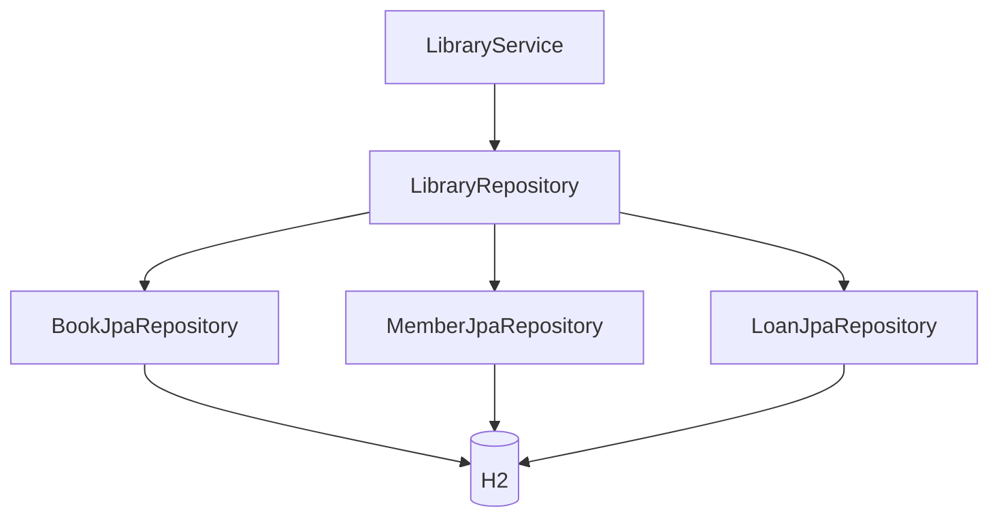
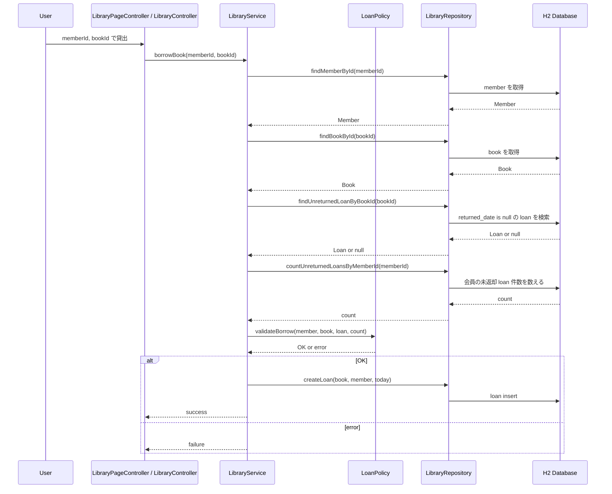
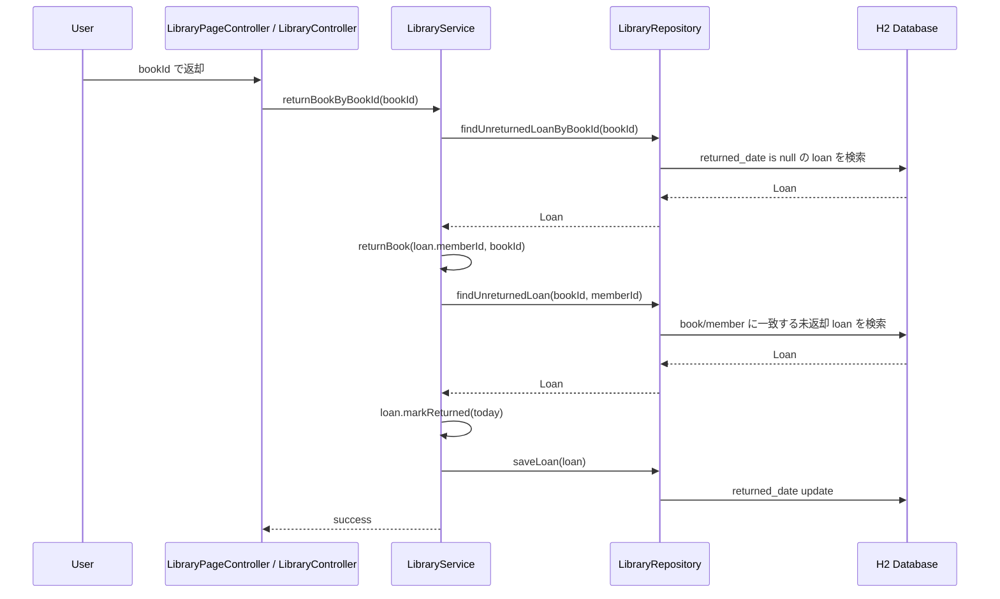

# 図書貸出デモ H2/JPA DB 化の変更説明

対象コミット: `4b4451a feat(demo): 図書貸出デモをH2/JPAでDB化する`

このファイルは、Pull Request ではなく単体コミットの説明として、今回の変更を概念だけでなくコードレベルでも追えるようにまとめたものです。

## 変更の全体像

これまでの図書貸出デモは、`LibraryRepository` が Java の `Map` / `List` で本・会員・貸出を保持していました。
今回の変更で、保存先を H2 + Spring Data JPA に置き換えました。

重要な設計変更は、貸出状態を `Book` や `Member` に分散して持たせず、`Loan.returnedDate` を正本にしたことです。

- `Book`: 本のマスタ情報だけを持つ。
- `Member`: 会員のマスタ情報だけを持つ。
- `Loan`: 貸出履歴と現在の貸出状態を持つ。
- `Loan.returnedDate == null`: 未返却、つまり貸出中。
- `Loan.returnedDate != null`: 返却済み。



## 依存関係と設定

`pom.xml` に JPA と H2 を追加しました。

- `spring-boot-starter-data-jpa`
- `h2`

アプリ本体は file-based H2 を使います。

```properties
spring.datasource.url=jdbc:h2:file:./data/library-demo
spring.jpa.hibernate.ddl-auto=update
spring.jpa.open-in-view=false
```

この設定により、通常起動では `JavaApp/demo/data/library-demo.mv.db` にデータが保存されます。
`data/` は生成物なので、`JavaApp/demo/.gitignore` に追加しています。

テストでは本体の file-based DB を触らないよう、`src/test/resources/application.properties` で in-memory H2 に分離しました。

```properties
spring.datasource.url=jdbc:h2:mem:library-demo-test;DB_CLOSE_DELAY=-1;DB_CLOSE_ON_EXIT=FALSE
spring.jpa.hibernate.ddl-auto=create-drop
```

## Entity の変更

### `Book`

変更前の `Book` は、貸出状態も持っていました。

- `borrowed`
- `borrowedByMemberId`
- `borrow()`
- `giveBack()`
- `isBorrowed()`
- `isAvailable()`

変更後は JPA Entity になり、本のマスタ情報だけを持ちます。

```java
@Entity
public class Book {
    @Id
    private String id;
    private String title;
    private String author;
}
```

貸出中かどうかは `Book` ではなく、`Loan` から判定します。

### `Member`

変更前の `Member` は、借りている本 ID のリストを持っていました。

- `borrowedBookIds`
- `borrowBook()`
- `returnBook()`
- `getBorrowedBookCount()`

変更後は JPA Entity になり、会員のマスタ情報だけを持ちます。

```java
@Entity
public class Member {
    @Id
    private String id;
    private String name;
}
```

会員が借りている冊数は、`Loan` の未返却レコード数から計算します。

### `Loan`

`Loan` は貸出状態の正本になりました。
`Book` / `Member` には `@ManyToOne` で関連を張り、DB 上も `loan.book_id` / `loan.member_id` が外部キーになります。

```java
@Entity
public class Loan {
    @Id
    @GeneratedValue(strategy = GenerationType.IDENTITY)
    private Long id;

    @ManyToOne(fetch = FetchType.LAZY, optional = false)
    @JoinColumn(name = "book_id", nullable = false)
    private Book book;

    @ManyToOne(fetch = FetchType.LAZY, optional = false)
    @JoinColumn(name = "member_id", nullable = false)
    private Member member;

    private LocalDate loanDate;
    private LocalDate returnedDate;
}
```

`Loan` の `getBook()` / `getMember()` には `@JsonIgnore` を付けています。
REST API の `/api/library/loans` で lazy relation を直接 JSON 化しないためです。
外部向けには `getBookId()` / `getMemberId()` で従来どおり ID を返せます。

```java
public boolean isUnreturned() {
    return returnedDate == null;
}

public void markReturned(LocalDate returnedDate) {
    this.returnedDate = returnedDate;
}
```

## DB 構造



`returned_date` が `null` の `loan` が「現在貸出中」です。
返却時は `loan` を削除せず、`returned_date` を入れます。
これにより、貸出履歴としても残せます。

## Repository 層

Spring Data JPA repository を追加しました。

- `BookJpaRepository extends JpaRepository<Book, String>`
- `MemberJpaRepository extends JpaRepository<Member, String>`
- `LoanJpaRepository extends JpaRepository<Loan, Long>`

`LoanJpaRepository` には、未返却 loan を扱う派生クエリを定義しています。

```java
List<Loan> findByReturnedDateIsNull();

Optional<Loan> findByBook_IdAndReturnedDateIsNull(String bookId);

Optional<Loan> findByBook_IdAndMember_IdAndReturnedDateIsNull(String bookId, String memberId);

long countByMember_IdAndReturnedDateIsNull(String memberId);
```

`Book_Id` や `Member_Id` は、`Loan.book.id` / `Loan.member.id` を辿る Spring Data JPA のプロパティパスです。

既存の `LibraryService` からの呼び出しを大きく変えないため、`LibraryRepository` は facade として残しています。
中では JPA repository に処理を委譲します。



`saveBook()` / `saveMember()` は、既存 ID の最大番号から次の ID を作ります。

```java
private String nextBookId() {
    return "b" + nextNumber(findAllBooks().stream().map(Book::getId).toList(), "b");
}
```

たとえば `b1`, `b2`, `b4` があれば、次は `b5` になります。

## 初期データ投入

`LibraryDataInitializer` を追加しました。
アプリ起動時に `book` と `member` の両方が空の場合だけ、初期データを投入します。

```java
if (libraryRepository.hasAnyBooks() || libraryRepository.hasAnyMembers()) {
    return;
}
```

この条件により、file-based H2 で片方のテーブルだけ残った状態にデモデータを足してしまう事故を避けています。
`loan` は初期投入しません。

## Service 層

`LibraryService` は transaction 境界を持つようになりました。

- 読み取り: `@Transactional(readOnly = true)`
- 貸出、返却、本追加、会員追加: `@Transactional`

貸出処理では、以下を DB から取得して `LoanPolicy` に渡します。

- 会員
- 本
- 対象本の未返却 loan
- 対象会員の未返却 loan 件数

```java
Loan unreturnedLoan = libraryRepository.findUnreturnedLoanByBookId(bookId);
long unreturnedLoanCount = libraryRepository.countUnreturnedLoansByMemberId(memberId);
String validationResult = loanPolicy.validateBorrow(member, book, unreturnedLoan, unreturnedLoanCount);
```

貸出可能なら、`Book` や `Member` を更新せず、新しい `Loan` を作ります。

```java
libraryRepository.createLoan(book, member, LocalDate.now());
```

返却処理では、対象の未返却 loan を探して `returnedDate` を入れます。

```java
Loan unreturnedLoan = libraryRepository.findUnreturnedLoan(bookId, memberId);
unreturnedLoan.markReturned(LocalDate.now());
libraryRepository.saveLoan(unreturnedLoan);
```

## 貸出処理の流れ



## 返却処理の流れ



## 画面表示への影響

`Book` と `Member` が貸出状態を持たなくなったため、画面用の行データは Service に問い合わせて作るようになりました。

`LibraryPageController` では、本一覧の `貸出中 / 貸出可能` を `libraryService.isBookBorrowed(book.getId())` で作ります。

```java
List<BookRowView> books = libraryService.getBooks().stream()
        .map(book -> BookRowView.from(book, libraryService.isBookBorrowed(book.getId())))
        .toList();
```

会員一覧の貸出冊数は、`libraryService.getBorrowedBookCount(member.getId())` で作ります。

```java
List<MemberRowView> members = libraryService.getMembers().stream()
        .map(member -> MemberRowView.from(member, libraryService.getBorrowedBookCount(member.getId())))
        .toList();
```

`BookRowView` と `MemberRowView` は、ドメインモデルから状態を直接読むのではなく、Controller から渡された値で表示用データを作る形になりました。

## テスト

`LibraryServiceTests` は、手作りの in-memory repository を直接 new する形から、Spring Boot + JPA + H2 のテストに変わりました。

```java
@SpringBootTest
@Transactional
class LibraryServiceTests {
    @Autowired
    private LibraryService libraryService;
}
```

テスト対象は次の流れです。

- 貸出できる。
- 同じ本の二重貸出は失敗する。
- 会員ごとの貸出上限が効く。
- 返却できる。
- 本 ID だけで返却できる。
- 本追加、会員追加が DB 経由で動く。

確認済みコマンド:

```bash
./mvnw test
```

結果:

```text
Tests run: 6, Failures: 0, Errors: 0, Skipped: 0
```

## この変更で変えなかったこと

- `/library` の URL
- `/api/library/*` の URL
- フォーム DTO や API request DTO の基本形
- 画面上の操作方法
- `LoanPolicy` を貸出可否判定の置き場にする構成

外から見た操作はそのままに、データ保持と貸出状態の正本だけを DB/JPA 側へ移しました。
