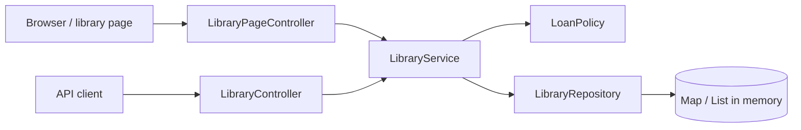
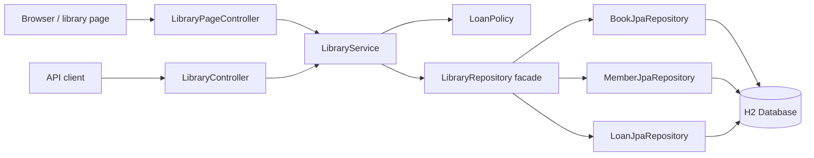
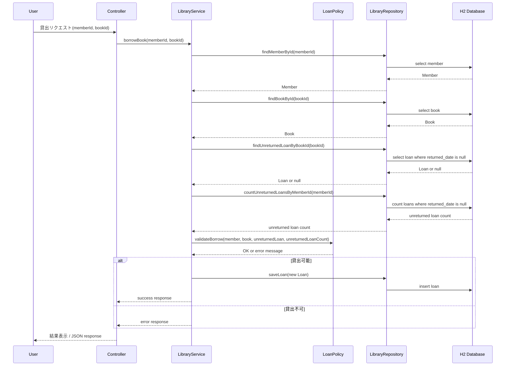
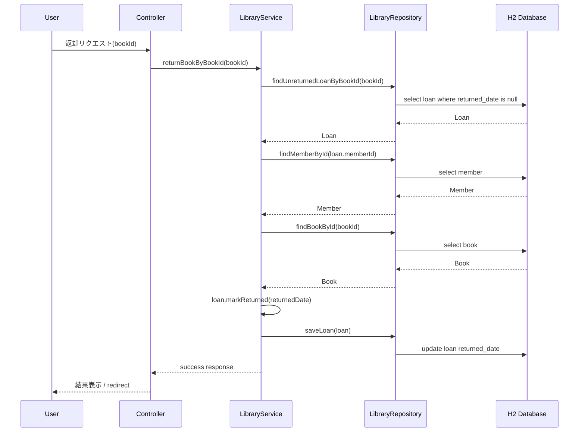
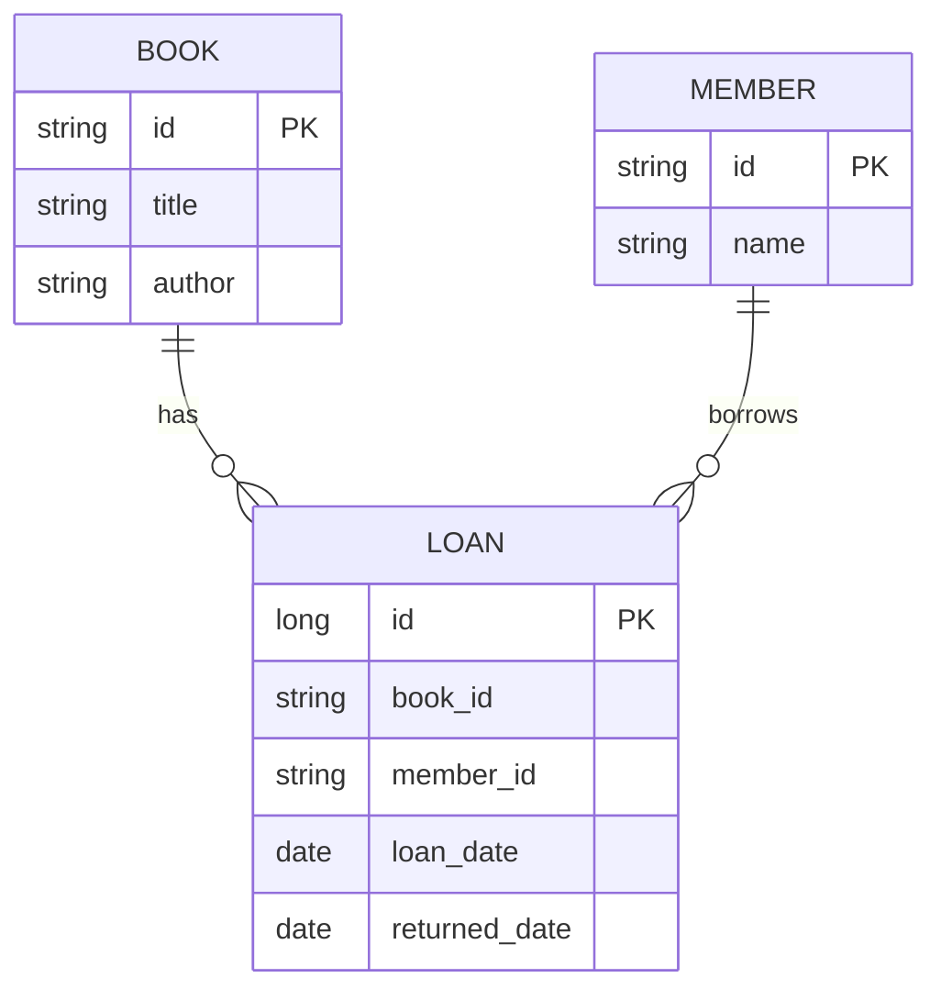

# 図書貸出デモ DB 化 実装計画

## 目的

現在の図書貸出デモは、`LibraryRepository` が `Map` と `List` でデータをメモリ上に保持している。
この計画では、既存の画面/API/業務ルールを保ったまま、保存先を H2 + Spring Data JPA に置き換える。

DB 化によって、次の学習テーマを扱える状態にする。

- Spring Data JPA の基本
- Entity と Repository の役割
- 起動時の初期データ投入
- in-memory 実装から DB 実装への置き換え
- DB を使ったテスト

## 現在の状態

- `/library` の MVC 画面がある。
- `/api/library/*` の REST API がある。
- 貸出、返却、本追加、会員登録ができる。
- Bean Validation と例外ハンドラが導入済み。
- 画面用 ViewModel が分離済み。
- `LibraryRepository` は in-memory 実装。
- `Book` / `Member` / `Loan` は JPA Entity ではない通常の Java クラス。

## 既存構成と変更後の違い

### 変更サマリ

| 観点 | 既存 | 変更後 |
| --- | --- | --- |
| データ保存先 | Java オブジェクト内の `Map` / `List` | H2 Database |
| データの寿命 | アプリ起動中のみ | H2 の設定に応じて再起動後も保持 |
| Repository | 自前の in-memory 実装 | Spring Data JPA repository を利用 |
| Service の役割 | 業務ルールと repository 呼び出し | 業務ルールと transaction 境界を担当 |
| Model | 通常の Java クラス | JPA Entity |
| 貸出状態 | `Book` / `Member` / `Loan` に分散 | `Loan.returnedDate` を正本にする |
| Controller / API | 変更なし | 変更なし |
| 画面操作 | 変更なし | 変更なし |
| テスト | pure Java に近い Service テスト | DB/JPA を含む Spring Boot テスト |

### 変わること

- 本、会員、貸出履歴が DB のテーブルとして保存される。
- `Book` / `Member` / `Loan` に JPA のアノテーションと JPA 用 constructor が入る。
- `LibraryRepository` の内部実装が `Map` / `List` から Spring Data JPA repository 呼び出しに変わる。
- 貸出中かどうかは `Loan.returnedDate == null` で判定する。
- 貸出や返却のように複数データを更新する処理では transaction を意識する。
- テストでは DB の初期化やデータ残りを考慮する必要がある。

### 変えないこと

- `/library` の URL と画面操作。
- `/api/library/*` の URL とリクエスト形式。
- `LibraryService` が業務ルールの中心である構成。
- `LoanPolicy` が貸出可否を判定する構成。
- `Book` / `Member` / `Loan` に責務を分ける OOP 学習用の形。
- 初期データの内容。

### 既存構成

現在は `LibraryRepository` がアプリ起動中だけ有効な `Map` / `List` を持っている。
アプリを再起動すると、追加した本・会員・貸出状態は初期状態に戻る。



### 変更後構成

DB 化後は、既存 Controller / Service から見た呼び出し口は大きく変えず、`LibraryRepository` の内側を Spring Data JPA と H2 に置き換える。
アプリ再起動後も、H2 の設定に応じて DB に保存した状態を扱える。



### 貸出処理のシーケンス



### 返却処理のシーケンス



## 実装方針

教材としての読みやすさを優先し、初回の DB 化では構成を大きく複雑にしない。

- `Book` / `Member` / `Loan` を JPA Entity 化する。
- 貸出状態の正本は `Loan` に一本化する。
- `LibraryRepository` は facade として残し、内部で Spring Data JPA repository interface を使う。
- Controller、Service、DTO、ViewModel、Thymeleaf テンプレートの外部仕様は維持する。
- ID は既存どおり `b1`, `b2`, `m1`, `m2` 形式を維持する。
- 初期データは `book` と `member` の両方が空のときだけ投入する。
- H2 は開発・学習用途として使い、本番 DB や migration tool は導入しない。

## DB 基本設計

### DB 選定

- DB は H2 を利用する。
- Spring Boot の学習用途として、追加インストールなしで起動できることを優先する。
- 永続化方式は `spring.datasource.url` で制御する。
  - 実装時の初期値は扱いやすい file-based H2 を想定する。
  - テストでは Spring Boot のテスト用 datasource または H2 の一時 DB を利用する。

### 論理エンティティ



### テーブル方針

- `book`: 本の基本情報だけを持つ。
- `member`: 会員の基本情報を持つ。
- `loan`: 貸出履歴と現在の貸出状態を持つ。
- 貸出中の判定は `loan.returned_date is null` とする。
- `loan.book_id` は `book.id`、`loan.member_id` は `member.id` を参照する外部キー制約を付ける。
- `Loan` は `Book` / `Member` への `@ManyToOne` を持たせ、DB 上も外部キー制約を張る。
- Controller、Service、フォーム、API は引き続き `bookId` / `memberId` を受け取り、Repository 層で ID から Entity を取得して扱う。

### データ整合性方針

- 貸出可否は `LoanPolicy` と `LibraryService` の業務ルールで判定する。
- `LoanPolicy` は DB アクセスを持たず、`LibraryService` から渡された `member` / `book` / 未返却 loan / 未返却 loan 件数だけで判定する。
- 貸出状態は `Loan` に一本化し、`Book` や `Member` には貸出状態を保存しない。
- 現在貸出中かどうかは、対象 book ID に `returned_date is null` の `loan` があるかで判定する。
- 会員の貸出冊数は、対象 member ID に紐づく `returned_date is null` の `loan` 件数で計算する。
- 返却時は対象の `loan.returnedDate` に返却日を入れる。
- 1冊の本に対して未返却の loan は最大1件とする。
- 初回 DB 化では、この「未返却 loan は最大1件」という制約は DB 制約ではなく `LibraryService` の業務ルールで担保する。
- 貸出時は対象 book ID の未返却 loan を検索し、存在する場合は貸出不可にする。
- 同時リクエストによる競合や DB の部分ユニークインデックスは、今回の教材フェーズでは扱わない。
- 初回 DB 化では、外部キー制約で存在しない本・会員への loan 登録を防ぎ、それ以外の業務ルールは Java 側の教材としての読みやすさを優先する。

## DB 詳細設計

### `book`

| カラム | 型 | Null | 概要 |
| --- | --- | --- | --- |
| `id` | varchar | no | 本 ID。例: `b1` |
| `title` | varchar | no | タイトル |
| `author` | varchar | no | 著者名 |

### `member`

| カラム | 型 | Null | 概要 |
| --- | --- | --- | --- |
| `id` | varchar | no | 会員 ID。例: `m1` |
| `name` | varchar | no | 会員名 |

### `loan`

| カラム | 型 | Null | 概要 |
| --- | --- | --- | --- |
| `id` | bigint | no | DB 用の貸出 ID。自動採番 |
| `book_id` | varchar | no | 本 ID。`book.id` を参照する |
| `member_id` | varchar | no | 会員 ID。`member.id` を参照する |
| `loan_date` | date | no | 貸出日 |
| `returned_date` | date | yes | 返却日。未返却なら `null` |

### 日付の扱い

初回 DB 化では既存モデルに合わせて `loanDate` / `returnedDate` は `LocalDate` とする。
これは「貸出した日」「返却した日」を表し、操作時刻までは保持しない。
将来、同日内の複数回貸出や監査ログ、時間単位の延滞判定を扱う場合は、`loanedAt` / `returnedAt` を `LocalDateTime` または `Instant` として追加・移行する。

### インデックス候補

- `book.id`: 主キー
- `member.id`: 主キー
- `loan.id`: 主キー
- `loan.book_id, loan.returned_date`: `findUnreturnedLoanByBookId` 用
- `loan.book_id, loan.member_id, loan.returned_date`: `findUnreturnedLoan` 用
- `loan.member_id, loan.returned_date`: 会員ごとの貸出中冊数計算用

### 採番設計

- `Book` は `b` + 次番号で採番する。
- `Member` は `m` + 次番号で採番する。
- 次番号は DB 上の既存 ID から最大数値を読み取って決める。
- 例: `b1`, `b2`, `b4` が存在する場合、次の本 ID は `b5`。
- 数値部分を読み取れない ID があっても処理を止めず、採番対象から除外する。

### トランザクション設計

- 貸出、返却、本追加、会員追加は Service 層の public method に `@Transactional` を付ける。
- 一覧取得など読み取りだけの処理は `@Transactional(readOnly = true)` を付ける。
- 貸出と返却は複数 Entity を更新するため、途中失敗時にまとめて rollback されることを期待する。
- 返却時の `Loan` 更新は JPA の dirty checking でも反映されるが、初回実装では学習用に `saveLoan` を明示してもよい。

### 初期データ投入設計

- 初期データ投入用の component を追加する。
- 起動時に `book` と `member` の両方が空の場合だけ投入する。
- 片方だけ空の場合は投入しない。
- file-based H2 で片方のテーブルだけ残った状態に初期データを足すと、デモデータが混ざって状態が崩れるため、自動補完はしない。
- `loan` は初期投入しない。

### H2 設定案

```properties
spring.datasource.url=jdbc:h2:file:./data/library-demo
spring.datasource.driver-class-name=org.h2.Driver
spring.datasource.username=sa
spring.datasource.password=
spring.jpa.hibernate.ddl-auto=update
spring.jpa.show-sql=true
spring.h2.console.enabled=true
spring.h2.console.path=/h2-console
```

### 設計上の注意点

- file-based H2 を使う場合、アプリを再起動してもデータが残る。
- テストではデータが残ると結果が不安定になるため、テスト用設定または `@Transactional` / cleanup を使う。
- `ddl-auto=update` は学習用途では扱いやすいが、本番運用では migration tool を使う。
- スキーマ変更で挙動がおかしくなった場合は、学習用 DB として `data/` を削除して作り直す。
- `loan.book_id` / `loan.member_id` には外部キー制約を付ける。
- 同じ book ID に未返却 loan が複数作られないことは、DB 制約ではなく `LibraryService` の業務ルールとテストで担保する。
- 貸出状態を `Book` / `Member` / `Loan` に重複保存しない。状態の正本は `Loan.returnedDate` とする。

## 変更対象

### 依存関係

`pom.xml` に次を追加する。

- `spring-boot-starter-data-jpa`
- `h2`

### 設定

`application.properties` に H2 と JPA の設定を追加する。

- H2 datasource
- JPA ddl-auto
- SQL 表示は学習用に必要なら有効化
- H2 console

### モデル

`Book` は次の形にする。

- `@Entity`
- `@Id String id`
- `title`
- `author`
- JPA 用 no-args constructor
- 貸出状態は持たせない

`Member` は次の形にする。

- `@Entity`
- `@Id String id`
- `name`
- JPA 用 no-args constructor
- 貸出中冊数や貸出中の本 ID は持たせない

`Loan` は次の形にする。

- `@Entity`
- DB 用主キー `@Id @GeneratedValue Long id`
- `@ManyToOne Book book`
- `@ManyToOne Member member`
- `loanDate`
- `returnedDate`
- JPA 用 no-args constructor
- 外部向けには `getBookId()` / `getMemberId()` で ID を返せるようにする
- `returnedDate == null` を貸出中とみなす
- `markReturned(LocalDate returnedDate)` で返却日を記録する

### Repository

Spring Data JPA repository interface を追加する。

- `BookJpaRepository`
- `MemberJpaRepository`
- `LoanJpaRepository`

`LibraryRepository` は既存 Service からの呼び出し口として残し、次の責務にする。

- 全件取得
- ID 検索
- 本追加
- 会員追加
- 貸出履歴保存
- 未返却 loan 検索
- 会員ごとの未返却 loan 件数取得
- 変更済み `Loan` の保存

### 初期データ

起動時に `book` と `member` の両方が空なら初期データを投入する。

- `b1`: `Java入門` / `Yamada`
- `b2`: `Spring Boot入門` / `Suzuki`
- `b3`: `設計の基本` / `Tanaka`
- `m1`: `Yuu`
- `m2`: `Aoi`

`book` または `member` のどちらか一方でもデータがある場合は投入しない。
`loan` は初期投入しない。

## 実装手順

1. `pom.xml` に JPA と H2 の依存関係を追加する。
2. `application.properties` に H2/JPA 設定を追加する。
3. `Book` / `Member` / `Loan` を Entity 化する。
4. Spring Data JPA repository interface を追加する。
5. `LibraryRepository` を JPA repository 利用に置き換える。
6. `LibraryService` に transaction 境界を追加し、`Loan.returnedDate` ベースの貸出状態判定に変更する。
   - 貸出、返却、本追加、会員追加は `@Transactional` を付ける。
   - 一覧取得は `@Transactional(readOnly = true)` を付ける。
   - 貸出時は対象 book ID の未返却 loan を検索し、存在する場合は貸出不可にする。
   - 返却時は取得した `Loan` に `markReturned(LocalDate.now())` を呼び、初回実装では `saveLoan` を明示してよい。
7. 初期データ投入クラスを追加する。
8. 既存テストを DB 前提に更新する。
9. `./mvnw test` で全体を確認する。
10. 必要なら `/library` 画面で手動確認する。

## テスト計画

### Service

DB 経由で次を確認する。

- 本を借りられる。
- すでに貸出中の本は借りられない。
- 同じ本に未返却 loan が複数作られない。
- 1 人が借りられる冊数の上限が守られる。
- 返却できる。
- 本 ID だけで返却できる。
- 本を追加できる。
- 会員を追加できる。
- 未返却 loan の件数が正しい。

### MVC/API

既存のテストを維持し、DB 化後も通ることを確認する。

- API の Bean Validation エラーが 400 で返る。
- 不正 JSON が統一された 400 レスポンスになる。
- MVC の想定外例外がフラッシュメッセージ付きで `/library` に戻る。
- Spring Boot の context が起動する。

### 実行コマンド

```bash
./mvnw test
```

## 今回の対象外

- 本番 DB 対応
- Flyway / Liquibase の導入
- 認証・認可
- 貸出履歴の詳細画面
- 同時リクエスト時の競合制御
- 未返却 loan を最大1件にする DB 部分ユニークインデックス
- REST API のレスポンス形式変更
- 画面デザインの大幅変更

## 完了条件

- in-memory の `Map` / `List` 保持が DB 保存に置き換わっている。
- 貸出状態の正本が `Loan.returnedDate` に一本化されている。
- 起動時に `book` と `member` の両方が空の場合だけ初期データが投入される。
- `/library` で既存と同じ操作ができる。
- `/api/library/*` の既存 API が動く。
- `./mvnw test` が成功する。
- 既存の学習用コードとして追いやすい構成を維持している。
