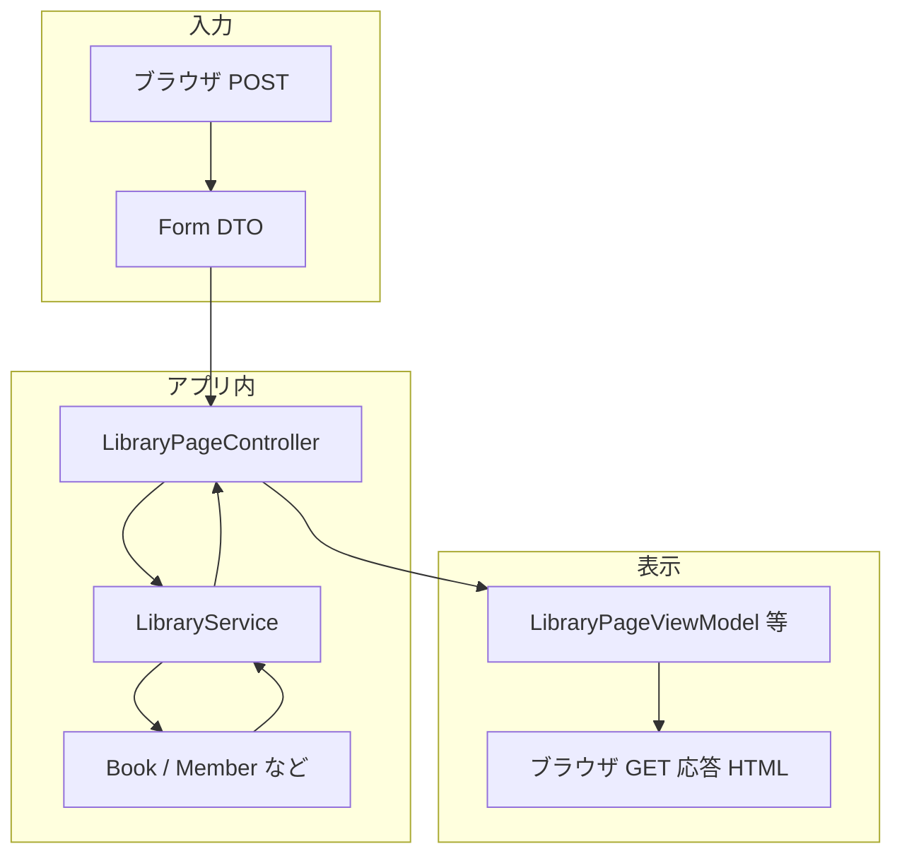

# 図書デモ：Phase 2（画面用DTO / ViewModel）の整理メモ

この文書は、図書貸出デモ（`JavaApp/demo`）について、**入力用DTOと表示用データを分ける話**を会話ベースで整理したものです。  
関連: [DTO.md](../DTO.md)、[ARCHITECTURE.md](../ARCHITECTURE.md)、ロードマップ [LIBRARY_DEMO_ROADMAP.md](../../demo/docs/LIBRARY_DEMO_ROADMAP.md)。

---

## 1. ロードマップ上の位置

`LIBRARY_DEMO_ROADMAP.md` の「次にやるならこの順」では、バリデーションの次に **画面用DTOまたはViewModelを分ける** が挙がっている。

このプロジェクトでは **Bean Validation は既に導入済み**（`spring-boot-starter-validation`、フォームの `@Valid` + `BindingResult`、API の `@Valid` と例外ハンドラなど）なので、「まずバリデーションを全部やり切る」より **Phase 2（表示用の型を分ける）に進む**のは自然な選択になる。

---

## 2. 「GET系」と「POST系」で参照する型を分ける、とは何か

HTTPメソッドそのものに縛るというより、**用途**で分けるイメージに近い。

| 用途 | 典型メソッド | 型のイメージ |
|------|----------------|--------------|
| ユーザーから受け取る | POST（フォーム）、PUT/PATCH（API） | **入力用** Request / Form DTO（バリデーションを付けやすい） |
| 画面やAPIで見せる・返す | GET（画面描画・JSON取得） | **出力用** Response DTO / **ViewModel** |

同じHTML（`library.html`）の中でも、

- **フォーム部分** … `th:object` で **入力用Form DTO**（例: `BorrowForm`）を参照する
- **一覧・プルダウンなど表示部分** … **表示用ViewModel**（例: `page.books`）を参照する

という **参照先の型を分ける** のが Phase 2 の中心になる。

---

## 3. いま `dto` パッケージは「ひとくくり」か

**物理的には** `com.example.demo.library.dto` に複数クラスが並んでいる。

**意味的には** すでに用途が混在している（入力用フォーム、API用リクエスト、操作結果の `ActionResponse` など）。  
フォルダ名が1つでも、**「入力」と「出力（表示・返却）」を意識して読み分ける**のがよい。

Phase 2 以降は、学習のしやすさのために例えば次のように **パッケージや命名で区切る**選択肢がある（実装時の方針として）。

- `dto.form` / `dto.api` / `view` など

---

## 4. いまの `library.html` の責務と、Phase 2 で変わるところ

### いまの責務（大きく変えない）

- **表示**: 本一覧・会員一覧・貸出中一覧、メッセージ、フィールドエラー
- **入力**: 各フォームの送信先URL、`th:object` によるバインド

### Phase 2 で変わる点（主にデータの「型」）

- **表示データ**が、ドメインモデル（`Book` / `Member`）を **テンプレートが直接触る**形から、**ViewModel（例: `LibraryPageViewModel`）経由**に寄せる
- **フォームまわり**（`BorrowForm` 等 + バリデーション表示）は原則 **そのまま**

つまり **Viewの責務は「画面を描く・フォームを出す」のまま**で、**「何の型のデータを受け取って描くか」**を画面専用の形に寄せる、という変化になる。

---

## 5. なぜ分けるとよいか（メリットの要約）

- **責務がはっきりする**: 入力契約（Form）と表示契約（ViewModel）が分かれ、読み手が追いやすい
- **テンプレートがドメイン変更に弱くならない**: `Book` の内部が変わっても、ViewModelの組み立て側だけ直せばよくなる
- **DB化・例外整理のあと工程で効く**: Entity や永続化の都合がテンプレートに漏れにくい

---

## 6. データの流れ（概念図）

---

## 7. 補足：処理まで「全部分ける」のか

Phase 2 の主眼は **データの形（DTO / ViewModel）の分離**である。  
変換ロジックは **Controller 内の private メソッド**から始めて十分なことが多く、最初から大きな Mapper 層を必須にする必要はない（必要になったら切り出す、でよい）。
